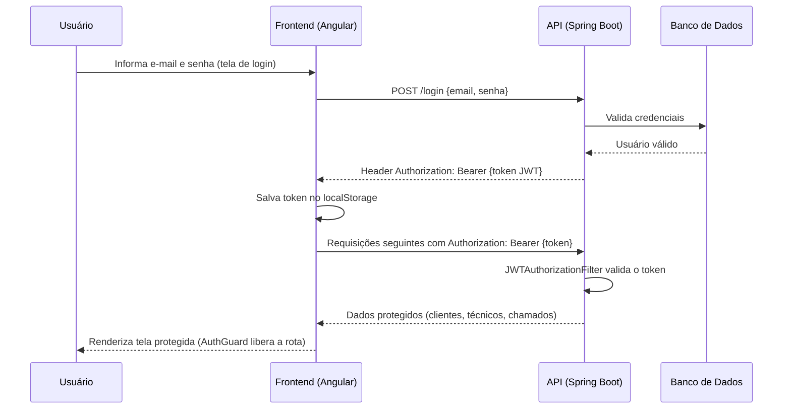
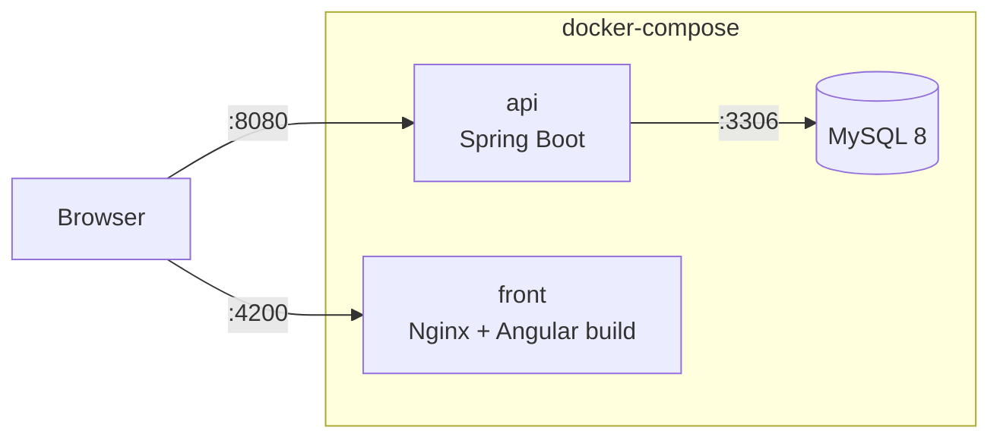

# 🛠 Helpdesk — Documentação Completa do Sistema

> Visão geral do projeto **Helpdesk**, composto por dois repositórios independentes: a API (backend) e a aplicação web (frontend). Este documento explica como as duas partes se integram, a arquitetura geral, o fluxo de autenticação e o modelo de domínio do sistema.


---

## 📌 Sobre o projeto

O **Helpdesk** é um sistema de suporte técnico que permite o gerenciamento de **clientes**, **técnicos** e **chamados**, com autenticação e controle de acesso via JWT. O sistema é dividido em dois repositórios que se comunicam via API REST:

| Repositório | Papel | Stack principal |
|---|---|---|
| [`helpdesk-api`](https://github.com/jnobr3c/helpdesk-api) | Backend / API REST | Java 11, Spring Boot, Spring Security, JPA, MySQL/H2 |
| [`helpdesk-front`](https://github.com/jnobr3c/helpdesk-front) | Frontend / Interface web | Angular 12, Angular Material |

---

## 🏗 Arquitetura geral do sistema

```mermaid
flowchart LR
    subgraph Frontend["helpdesk-front (Angular 12)"]
        UI[Componentes: Login, Cliente, Técnico, Chamado]
        Interceptor[AuthInterceptor]
        Guard[AuthGuard]
    end

    subgraph Backend["helpdesk-api (Spring Boot)"]
        Controller[Resources / Controllers]
        Service[Services - Regras de negócio]
        Repository[Repositories - Spring Data JPA]
        Security[Spring Security + Filtros JWT]
    end

    DB[(MySQL / H2)]

    UI -->|HTTP requests| Interceptor
    Interceptor -->|Authorization: Bearer token| Controller
    Controller --> Security
    Security --> Service
    Service --> Repository
    Repository --> DB
    Guard -.protege rotas.-> UI
```



- O **frontend** roda por padrão em `http://localhost:4200` e consome a API configurada em `http://localhost:8080` (ver `src/app/config/api.config.ts`).
- A comunicação é **stateless**: a cada requisição, o token JWT é enviado no header `Authorization`.
- O backend segue arquitetura em camadas: `Controller → Service → Repository → Database`.

---

## 🔐 Fluxo de autenticação (integração front + back)



**No backend:**
- `JWTAuthenticationFilter` gera o token no login (algoritmo HS512, expiração configurável em `application.properties`).
- `JWTAuthorizationFilter` valida o token a cada requisição subsequente.
- Sessões são **stateless** (`SessionCreationPolicy.STATELESS`), sem estado guardado no servidor.
- CORS liberado para os métodos `GET`, `POST`, `PUT`, `DELETE`, `OPTIONS`.

**No frontend:**
- `AuthService` faz o POST em `/login` e guarda o token retornado no `localStorage`.
- `AuthInterceptor` injeta automaticamente o header `Authorization: Bearer {token}` em toda requisição HTTP.
- `AuthGuard` protege as rotas internas (`/home`, `/clientes`, `/tecnicos`, `/chamados`), redirecionando usuários não autenticados para `/login`.

---

## 🧠 Modelo de domínio

Entidades principais compartilhadas entre front e back:

```
Pessoa (abstrata)
 ├── Cliente
 └── Tecnico

Chamado
 ├── Cliente (1:N)
 ├── Tecnico (1:N)
 ├── Status: ABERTO | ANDAMENTO | ENCERRADO
 └── Prioridade: BAIXA | MEDIA | ALTA

Perfil (enum): ADMIN | CLIENTE | TECNICO
```

No frontend, esses mesmos conceitos aparecem como interfaces TypeScript em `src/app/models` (`cliente.ts`, `tecnico.ts`, `chamado.ts`, `credenciais.ts`), espelhando os DTOs expostos pela API.

---

## 📡 Endpoints principais da API

| Recurso | Endpoints |
|---|---|
| Autenticação | `POST /login` |
| Clientes | `GET /clientes`, `GET /clientes/{id}`, `POST /clientes`, `PUT /clientes/{id}`, `DELETE /clientes/{id}` |
| Técnicos | `GET /tecnicos`, `GET /tecnicos/{id}`, `POST /tecnicos`, `PUT /tecnicos/{id}`, `DELETE /tecnicos/{id}` |
| Chamados | `GET /chamados`, `GET /chamados/{id}`, `POST /chamados`, `PUT /chamados/{id}`, `DELETE /chamados/{id}` |

Cada um desses recursos possui uma tela correspondente no frontend (listagem, criação, atualização e exclusão), em `src/app/components/{cliente,tecnico,chamado}`.

---

## ▶️ Rodando o sistema completo (front + back) localmente

### 1. Backend
```bash
git clone https://github.com/jnobr3c/helpdesk-api.git
cd helpdesk-api
mvn spring-boot:run
```
A API sobe em `http://localhost:8080` (console H2 em `/h2-console` quando o profile `test` estiver ativo).

### 2. Frontend
```bash
git clone https://github.com/jnobr3c/helpdesk-front.git
cd helpdesk-front
npm install
ng serve
```
A aplicação sobe em `http://localhost:4200` e já está configurada para apontar para a API em `localhost:8080` (`src/app/config/api.config.ts`).

> ⚠️ Certifique-se de que o backend esteja rodando **antes** de iniciar o frontend, já que a tela de login depende da API para autenticar.

---

## 🐳 Rodando via Docker

Ambos os repositórios possuem um `Dockerfile` (multi-stage build) e são orquestrados por um `docker-compose.yml` no repositório `helpdesk` (o orquestrador com os submodules).



**Como rodar:**
```bash
git clone --recurse-submodules https://github.com/jnobr3c/helpdesk.git
cd helpdesk
docker compose up --build
```

- `mysql`: banco MySQL 8, com volume persistente `helpdesk-mysql-data`.
- `api`: build multi-stage (Maven compila o `.jar`, depois roda só com JRE 11). Sobe com profile `dev`, apontando para o serviço `mysql` do compose. `ddl-auto: create`, então o schema e os dados de exemplo (`DBService`) são recriados a cada `up`.
- `front`: build multi-stage (Node compila o Angular, depois o Nginx serve os arquivos estáticos com fallback de rotas para SPA).

Acesse em `http://localhost:4200`. Para derrubar tudo: `docker compose down` (ou `-v` para também apagar os dados do MySQL).

### Rodando 100% no navegador, sem instalar nada

Como o app roda via Docker, é possível usar **GitHub Codespaces** (ou Gitpod) para ter Java, Node e Docker prontos em uma VM na nuvem, acessível pelo navegador — sem instalar nada localmente. Basta abrir o repositório `helpdesk` no GitHub, criar um Codespace e rodar `docker compose up --build` dentro dele; a porta 4200 pode ser aberta direto no navegador via port-forward automático do Codespaces. Detalhes no `README.md` do repositório orquestrador.

---

## 📂 Estrutura resumida dos repositórios

```
helpdesk-api/
 └── src/main/java/com/nobre/helpdesk
      ├── config        # Segurança, CORS, profiles (dev/test)
      ├── security       # Filtros e utilitário JWT
      ├── resources       # Controllers REST
      ├── services       # Regras de negócio
      ├── repositories    # Spring Data JPA
      └── domain          # Entidades e enums

helpdesk-front/
 └── src/app
      ├── auth            # AuthGuard
      ├── interceptor     # AuthInterceptor (injeta o token JWT)
      ├── config          # URL base da API
      ├── services        # Chamadas HTTP (auth, cliente, técnico, chamado)
      ├── models           # Interfaces TS espelhando os DTOs da API
      └── components       # Telas: login, home, cliente, técnico, chamado
```

---

## 🚀 Possíveis evoluções futuras

- Refresh token / renovação automática de sessão no frontend
- Testes end-to-end cobrindo o fluxo completo (login → CRUD → logout)
- Deploy conjunto (docker-compose unindo API + frontend + MySQL)
- Documentação de contrato da API (OpenAPI/Swagger)

---

## 👨‍💻 Autor

José Nobre
🔗 [GitHub](https://github.com/jnobr3c) · 🔗 [LinkedIn](https://www.linkedin.com/in/jos%C3%A9-nobrec/)
